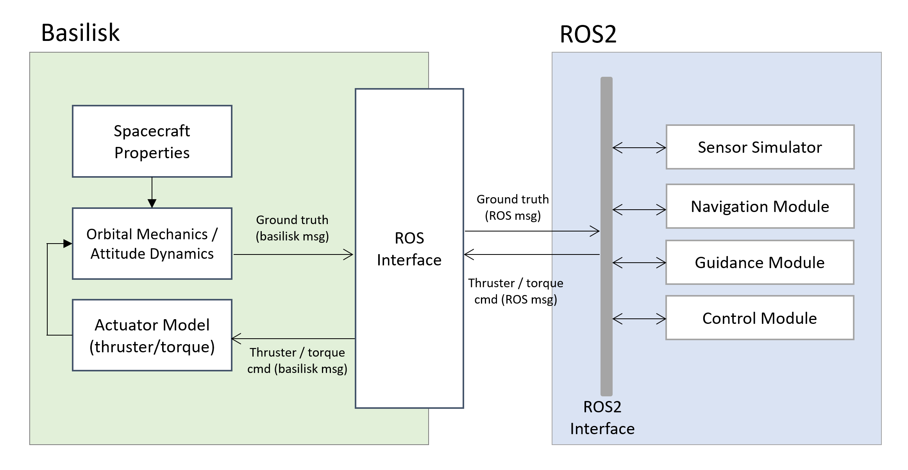

# ROS Basilisk

ROS Basilisk is a wrapper that provides ROS2-interface for [Basilisk Astrodynamics Simulation Framework](http://hanspeterschaub.info/basilisk/). Tested on Ubuntu 20.04 LTS, ROS2 Galactic. This package aims to support the numerical verification and validation of spacecraft GNC and higher level authonomy software implemented with ROS2. 


The main functionality of ROS Basilisk is to run (1) Basilisk simulation side by side with other ROS nodes and (2) provide examples for how Basilisk messages can be translated to ROS messages and vice versa.



## Docker

We provide the docker container with ROS2 and Basilisk pre-installed. Please see the docker instruction [here](docker/README.md).

## Manual Instruction

In this instruction, we assume Basilisk is installed at `/home/UserName/basilisk` (home directory) and ROS2 workspace is created at `/home/UserName/basilisk_ws`. The choice of installation location for Basilisk and other software is up to the user but paths should be changed appropriately.

The repo also provides basic attitude control and formation keeping algorithms implemented in ROS2 for the demonstration purpose.

### Prerequisites
1. Install ROS2 Galactic
1. Install [Basilisk](https://hanspeterschaub.info/basilisk/Install/installOnLinux.html). We assme Basilisk is installed in home directory `/home/UserName/`. Some tips regarding Basilisk installation:
   1. Make sure you are in a venv!
   1. Install using this command: `python3 conanfile.py --clean --opNav True --vizInterface True --buildProject True`
   1. For debug mode: `python3 conanfile.py --clean --buildType Debug --opNav True --vizInterface True --buildProject True`.
      1. Debug mode allows for more descriptive error messages in `gdb` or other C debuggers. Can also debug in Release.
         Could use CLion too, use these instructions to debug in CLion: https://www.jetbrains.com/help/clion/debugging-python-extensions.html#attach-py

### Setup ROS2 workspace
1. If the workspace does not already exists, create one `mkdir -p basilisk_ws/src`
1. Clone this repo into workspace `cd basilisk_ws/src && git clone https://github.com/aerorobotics/ros2basilisk`
1. Install Python pre-requisites within the virtual environment `source ~/basilisk/.venv/bin/activate && pip3 install -r ros2basilisk/requirements.txt`

### Running Demo
1. Build workspace at the top of workspace directory `cd ~/basilisk_ws && colcon build`
1. Source the envrionment `source ~/basilisk/.venv/bin/activate && source ~/basilisk_ws/install/setup.bash`
1. Add python paths. Launch needs the Basilisk python location: `export PYTHONPATH=$PYTHONPATH:/home/$(id -un)/basilisk/.venv/lib/python3.8/site-packages && export PYTHONPATH=$PYTHONPATH:/home/$(id -un)/basilisk/dist3` 
1. Launch ROS2Basilisk: `ros2 launch ros2basilisk demo_launch.py ws:="/home/UserName/basilisk_ws/"` This creates output data in data/runs/default_run
1. Visualize the simulation result: `python src/ros2basilisk/script/data_analysis.py`

<!-- ## Repo Information
This repo is a ROS2 mixed Cpp and Python repo. We use Cpp for the messages but all the ROS2 nodes are in Python. This means that creating new nodes, messages, and algorithms requires updating the `CMakeLists.txt` file.
1. Folder `algorithm_base` contains the ROS2 side LQR code and helper files.
1. Folder `config` contains all the configuration files for the different launch files
1. Folder `docker` contains all things needed for the docker container
1. Folder `docs` contains docs and images for the README
1. Folder `launch` contains all the ROS2 launch files.
1. Folder `msg` contains all the ROS2 versions of Basilisk messages and other ROS2 messages that are used by the package.
1. Folder `ros2basilisk` contains all the files needed to convert Basilisk messages into ROS2 messages (The ROS2 Interface in the ROS Basilisk Diagram).
1. Folder `scripts` contains all the helper scripts for post simulation analysis. -->


## Customization

### Creating ROS/Basilisk messages
This is same as creating a ROS2 message. 
1. Create a file in the `msg` folder. Call it `YOUR_MESSAGE_NAME.msg`, then fill it out.
1. Add `"msg/YOUR_MESSAGE_NAME.msg"` into `CMakeLists.txt`, add it into the function where it starts with `rosidl_generate_interfaces(${PROJECT_NAME}` where all the other messages are.

### Creating new simulation scenarios
1. Modify RosBasilisk.py, RosBskTask.py, and Simulation.py to modify Basilisk simulation scenario.


## Citation

If you use this repository, please make sure to cite our work.
```
@inproceedings{matsuka2023high,
  title={High-Fidelity, Closed-Loop Simulation of Spacecraft Vision-Based Relative Navigation in ROS2},
  author={Matsuka, Kai and Zhang, Leo and Ragheb, Isabelle and Ohenzuwa, Christine and Chung, Soon-Jo},
  year={2023},
  publisher={AIAA},
  booktitle={2023 33rd AAS/AIAA Space Flight Mechanics Meeting}
}
```
This work was presented at 33rd AAS/AII Space Flight Mechanics Meeting in a paper titled "High-fidelity, closed-loop simulation of spacecraft vision-based relative navigation in ROS2." Our paper can be found [here](docs/AAS_Flight_Mechanics_2023_Paper.pdf).


<!-- 
## Creating new algorithms
When making a new algorithm, you can add the files into the `algorithm_base` folder, create a new folder for helper functions and if it is a node that will be called by a launch file or by `ros2 run ros2basilisk NODE` then it will need to be at the `algorithm_base` folder. We would need to update the `CMakeLists.txt` to add in all the new helper files and the new nodes. -->

<!-- ## Visualizing
Download [Vizard](https://hanspeterschaub.info/basilisk/Vizard/VizardDownload.html).

If you are on Ubuntu, unzip the file, go into the folder and open `Vizard.x86_64`.

For Basilisk Message File, select the .bin file in `_VizFiles` folder. Then make sure connection type is DirectComm and
mode is LiveDisplay. Then press visualize and the spacecraft simulator should start playing. -->
